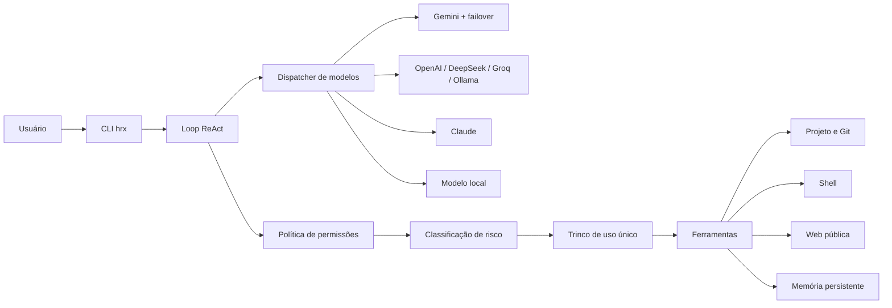

<div align="center">

# HRX Code

### Um agente de IA no terminal que entende, altera e valida projetos com controle de risco.

[](https://github.com/kaue34381210-star/hrx-code/actions/workflows/tests.yml)
[](https://www.python.org/)
[](https://github.com/kaue34381210-star/hrx-code/releases/tag/v0.1.0)
[](LICENSE)


<sub>Demonstração ilustrativa do fluxo real de ferramentas e aprovação.</sub>

</div>

O HRX Code leva um fluxo de agente de código para a linha de comando: ele navega
no projeto, busca e edita arquivos, executa testes, usa Git e mantém memória
entre sessões. Cada operação sensível passa por uma política de permissões antes
de chegar ao sistema.

## Por que este projeto é diferente

| Agente de código | Segurança em camadas | Modelos plugáveis |
| --- | --- | --- |
| Loop ReAct com ferramentas para leitura, busca, edição, shell, Git e documentos. | Risco 🟢🟡🔴, autorização de uso único, isolamento de caminhos e proteção contra SSRF. | Gemini, OpenAI, DeepSeek, Groq, Claude, Ollama e endpoints locais compatíveis. |

## Início rápido

Requer Python 3.10 ou superior.

```bash
git clone https://github.com/kaue34381210-star/hrx-code.git
cd hrx-code
python -m venv .venv
. .venv/bin/activate
python -m pip install .
hrx --version
hrx
```

Dentro do chat, use `/config` para escolher o provedor, modelo, URL e chave. O
motor inicial é local e as credenciais são gravadas fora do repositório, em
`~/.config/hrx/motor.json`.

## Veja o fluxo em ação

Peça uma tarefa completa em linguagem natural:

```text
você › revise este projeto, corrija os problemas encontrados e rode os testes

  ⚙ listar_diretorio(caminho='.', recursivo=True)
  ⚙ buscar_codigo(padrao='TODO|FIXME', caminho='.', ext='.py')
  ⚙ editar_arquivo(caminho='app.py', ...)
  🟡 confirmação — escreve/sobrescreve arquivo no projeto
  executar? [Enter=sim · n=não · s=sempre] ›
```

Um comando destrutivo recebe tratamento diferente:

```text
  ⚙ rodar_comando(comando='rm -rf build')
  🔴 ALTO RISCO — remove arquivos/diretórios
  para executar digite sim › não
  ✋ execução cancelada pelo usuário.
```

Também é possível executar uma tarefa sem abrir o chat interativo:

```bash
hrx "explique a arquitetura deste projeto e aponte os principais riscos"
```

## Arquitetura



O modelo escolhe uma ferramenta e seus argumentos. O núcleo valida a chamada,
solicita aprovação quando necessário e abre uma autorização válida somente para
aquela execução. O resultado volta ao histórico e o ciclo continua até a
resposta final.

## Provedores suportados

| Motor | Protocolo | Chave obrigatória | Destaque |
| --- | --- | --- | --- |
| Local / llamafile | Chat Completions | Não | Privacidade e uso offline |
| Ollama | Chat Completions | Não | Modelos locais gerenciados |
| Gemini | Gemini API | Sim | Pool de chaves com cooldown e failover |
| OpenAI | Chat Completions | Sim | Modelos da OpenAI |
| DeepSeek | Chat Completions | Sim | Endpoint configurável |
| Groq | Chat Completions | Sim | Inferência rápida |
| Claude | Anthropic Messages | Sim | Adaptador próprio para o protocolo |

## Capacidades

- Navegação, leitura, busca e edição de código com números de linha.
- Execução de shell e operações Git no diretório do projeto.
- Criação de planilhas Excel e documentos PDF.
- Consulta de CVEs na API do NVD e leitura de páginas públicas.
- Memória persistente com modo compacto para economizar contexto.
- Comandos customizados por arquivos Markdown em `~/.config/hrx/comandos/`.
- Perfis configuráveis com nome, tom, idioma e projeto atual.

Comandos úteis no chat: `/config`, `/perfil`, `/motor`, `/modo`, `/permissoes`,
`/memoria`, `/comandos`, `/debug`, `/resumo`, `/novo`, `/ajuda` e `/sair`.

## Segurança

- Leituras são limitadas à raiz real do projeto após resolver `~`, `..` e
  links simbólicos.
- Escritas externas são sempre classificadas como alto risco, inclusive no
  modo automático.
- Comandos são classificados como verde, amarelo ou vermelho; riscos vermelhos
  nunca são rebaixados por uma permissão anterior.
- Ferramentas sensíveis exigem uma autorização de uso único correspondente ao
  comando aprovado.
- URLs resolvem todos os endereços IPv4 e IPv6 e bloqueiam redes privadas,
  loopback, link-local, multicast e endereços reservados.
- Chaves e preferências ficam em arquivos de configuração fora do pacote e com
  permissões restritas quando o sistema operacional oferece suporte.

> Não envie segredos ou dados sensíveis a provedores externos. Consulte os
> termos do provedor escolhido antes de usar informações privadas.

## Desenvolvimento

```bash
python -m pip install -e ".[dev]"
python -m pytest
```

A suíte possui 77 testes, cobre atualmente 42% do pacote e roda no GitHub
Actions com Python 3.10, 3.11, 3.12 e 3.13. O CI exige no mínimo 40% de
cobertura. Para recriar a demonstração do README, instale o FFmpeg e execute:

```bash
./docs/render-demo.sh
```

## Estrutura principal

```text
src/hrx_code/
├── agente.py          loop ReAct, interface e configuração interativa
├── ferramentas.py     código, documentos, memória, web, shell e Git
├── permissao.py       política da sessão e autorização de uso único
├── aprovacao.py       classificação heurística de risco
├── caminhos.py        resolução canônica e isolamento de diretórios
├── gemini.py          cliente Gemini e rotação de chaves
├── openai_compat.py   OpenAI, DeepSeek, Groq e Ollama
├── claude.py          adaptador para Anthropic Messages
├── local.py           endpoint local compatível com Chat Completions
└── config.py          configuração persistente e variáveis de ambiente
tests/                 suíte automatizada
```

As decisões técnicas e mudanças relevantes estão em [`MEMORIA.md`](MEMORIA.md),
e o histórico de versões está em [`CHANGELOG.md`](CHANGELOG.md).

## Licença

Uso gratuito sob licença proprietária: cópias exatas podem ser compartilhadas,
mas modificações e venda não são permitidas. Consulte [`LICENSE`](LICENSE).

© 2026 Kauê. Todos os direitos reservados.
